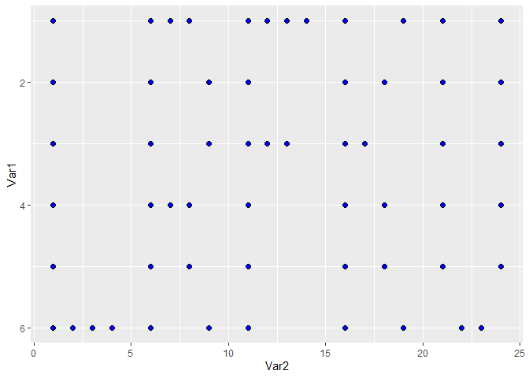

``` r
library(tidyverse)
```

    ## -- Attaching packages --------------------------------------- tidyverse 1.3.1 --

    ## v ggplot2 3.3.5     v purrr   0.3.4
    ## v tibble  3.1.5     v dplyr   1.0.7
    ## v tidyr   1.2.0     v stringr 1.4.0
    ## v readr   2.0.2     v forcats 0.5.1

    ## -- Conflicts ------------------------------------------ tidyverse_conflicts() --
    ## x dplyr::filter() masks stats::filter()
    ## x dplyr::lag()    masks stats::lag()

``` r
library(unglue)
library(lubridate)
```

    ## 
    ## Attaching package: 'lubridate'

    ## The following objects are masked from 'package:base':
    ## 
    ##     date, intersect, setdiff, union

``` r
library(data.table)
```

    ## 
    ## Attaching package: 'data.table'

    ## The following objects are masked from 'package:lubridate':
    ## 
    ##     hour, isoweek, mday, minute, month, quarter, second, wday, week,
    ##     yday, year

    ## The following objects are masked from 'package:dplyr':
    ## 
    ##     between, first, last

    ## The following object is masked from 'package:purrr':
    ## 
    ##     transpose

``` r
library(reshape2)
```

    ## 
    ## Attaching package: 'reshape2'

    ## The following objects are masked from 'package:data.table':
    ## 
    ##     dcast, melt

    ## The following object is masked from 'package:tidyr':
    ## 
    ##     smiths

### Day 1

### [— Day 1: The Tyranny of the Rocket Equation —](https://adventofcode.com/2019/day/1)

#### Part-1

``` r
input <- read_lines('input1.txt')
answer1_1 <- function(input){
  input <- input |> as.double()
  sum(floor(input/3) -2)
}

answer1_1(input)
```

    ## [1] 3267890

#### Part-2

``` r
answer1_2 <- function(input){
  x <- input
  y <- rep(0, length(input))
  while(any(x>0)){
    x <- reduce(1, .init = x, ~ pmax(0, floor(as.numeric(.x)/3)-2))
    y <- y + x
  }
  sum(y)
}

answer1_2(input)
```

    ## [1] 4898972

### Day 2

### [— Day 2: 1202 Program Alarm —](https://adventofcode.com/2019/day/2)

#### Part-1

``` r
input <- read_lines('input2.txt') %>% str_split(',') %>% unlist %>% as.integer()

## part-1
answer2_1 <- function(x){
  #set initial values
  x[2] <- 12
  x[3] <- 2
  # set i (iteration)
  i <- 1
  # while loop
  while(TRUE){
    if(x[4*(i-1)+1] ==99){
      break
    } else if (x[4*(i-1)+1] == 1){
      x[x[4*i] +1] <- x[x[4*(i-1)+2] +1] + x[x[4*(i-1)+3] +1]
    } else {
      x[x[4*i] +1] <- x[x[4*(i-1)+2] +1] * x[x[4*(i-1)+3] +1]
    }
    i <- i +1
  }
  # final answer
  x[1]
}

answer2_1(input)
```

    ## [1] 3224742

#### Part-2

``` r
answer2_2 <- function(input){
  # set x
  mat <- matrix(rep(0, 100*100), nrow = 100)
  x <- input
  for(j in seq(100) -1){
    for(k in seq(100)-1){
      
      #set initial values
      x[2] <- j
      x[3] <- k
      # set i (iteration)
      i <- 1
      # while loop
      while(TRUE){
        if(x[4*(i-1)+1] ==99){
          break
        } else if (x[4*(i-1)+1] == 1){
          x[x[4*i] +1] <- x[x[4*(i-1)+2] +1] + x[x[4*(i-1)+3] +1]
        } else {
          x[x[4*i] +1] <- x[x[4*(i-1)+2] +1] * x[x[4*(i-1)+3] +1]
        }
        i <- i +1
      }
      # input mat value
      mat[j+1, k+1] <- x[1]
      # reset x
      x <- input
      
    }
  }
  # final answer
  100*(which(mat == 19690720, arr.ind = TRUE)[1]-1)+(which(mat == 19690720, arr.ind = TRUE)[2]-1)
}

answer2_2(input)
```

    ## [1] 7960

### Day 3

### [](https://adventofcode.com/2019/day/3)

#### Part-1

``` r
input <- read_lines('input3.txt') %>% 
  str_split(',')
answer3_1 <- function(input){
  # define another helper function
  wir_dir <- function(x){
    if(startsWith(x, 'R')){
      1+0i
    } else if(startsWith(x, 'L')){
      -1+0i
    } else if(startsWith(x, 'U')){
      0+1i
    } else {
      0-1i
    }
  }
  # init value
  wire_init <- 0+0i
  # final answer
  map(input, function(.a) reduce(.a, .init = wire_init,
                                 ~ append(.x, 
                                          seq(.x[length(.x)], 
                                              by = wir_dir(.y), 
                                              length.out = 1+as.numeric(gsub('^\\w', '', .y)))[-1]))) %>% 
    reduce(intersect) %>% 
    map_dbl(~ abs(Re(.x))+abs(Im(.x))) %>% 
    {.[.>0]} %>% 
    min()
}

answer3_1(input)
```

    ## [1] 5319

#### Part-2

``` r
answer3_2 <- function(input){
  # helper function
  wir_dir <- function(x){
    if(startsWith(x, 'R')){
      1+0i
    } else if(startsWith(x, 'L')){
      -1+0i
    } else if(startsWith(x, 'U')){
      0+1i
    } else {
      0-1i
    }
  }
  
  wire_init <- 0+0i
  
  complete_map <- map(input, function(.a) reduce(.a, .init = wire_init,
                                                 ~ append(.x, 
                                                          seq(.x[length(.x)], 
                                                              by = wir_dir(.y), 
                                                              length.out = 1+as.numeric(gsub('^\\w', '', .y)))[-1])))
  
  complete_map <- map(complete_map, ~.x[-(1)])
  joints <- reduce(complete_map, intersect)
  
  map_int(joints, \(.a) sum(map_int(complete_map, ~ which(.a == .x)))) %>% 
    min()
}

answer3_2(input)
```

    ## [1] 122514

### Day 4

### [— Day 4: Secure Container —](https://adventofcode.com/2019/day/4)

#### Part-1

``` r
answer4_1 <- function(){
  x <- map_lgl(152085:670283,
               ~ {y <- str_split(as.character(.x), '') %>% 
                 unlist %>% 
                 as.numeric() %>% 
                 diff ;
               all(y >= 0) & any(y == 0)
               })
  sum(x)
}

answer4_1()
```

    ## [1] 1764

#### Part-2

``` r
answer4_2 <- function(){
  x <- map_lgl(152085:670283,
               ~{y <- str_split(as.character(.x), '') %>% 
                 unlist;
               (2 %in% rle(y)$lengths) & all(diff(as.integer(y)) >= 0)})
  sum(x)
}

answer4_2()
```

    ## [1] 1196

### Day 5

### [](https://adventofcode.com/2019/day/5)

#### Part-1

#### Part-2

### Day 6

### [](https://adventofcode.com/2019/day/6)

#### Part-1

#### Part-2

### Day 7

### [](https://adventofcode.com/2019/day/7)

#### Part-1

#### Part-2

### Day 8

### [— Day 8: Space Image Format —](https://adventofcode.com/2019/day/8)

#### Part-1

``` r
input8 <- read_lines('input8.txt')
answer8_1 <- function(input8, pixels = 150){
  input_mat <- input8 %>% str_split('') %>% 
    unlist %>% 
    as.integer() %>% 
    matrix(byrow = T, ncol = pixels)
  layer <- input_mat[rowSums(input_mat == 0) %>% which.min(),]
  sum(layer == 1)*sum(layer==2)
}

answer8_1(input8)
```

    ## [1] 2460

#### Part-2

``` r
answer8_2 <- function(input8, width = 25, length = 6){
  input_mat <- input8 %>% str_split('') %>% 
    unlist %>% 
    as.integer() %>% 
    matrix(byrow = F, nrow = width*length)
  
  # 150 pixels are in rows, layers in cols
  # split pixels for each layer
  
  m <- map_int(unname(split(input_mat, seq(150))), ~ .x[which.max(.x != 2)]) %>% 
    matrix(byrow = T, ncol = 25)
  
  # final plot
  melt(m) %>% 
    subset(value == 1) %>% 
    ggplot(aes(Var2, Var1)) +
    geom_point(size = 2, fill = "blue", shape = 21) +
    scale_y_reverse()
  
}

answer8_2(input8)
```


